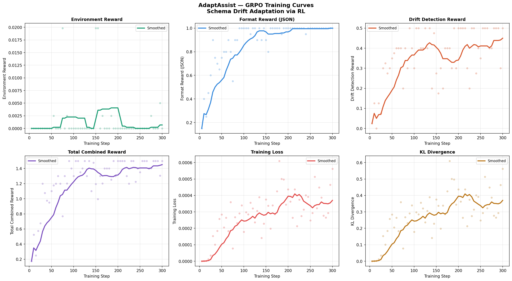

# Training Reward Curves

This folder contains the GRPO reinforcement learning training curves generated from training
`Llama-3.2-3B-Instruct` on the AdaptAssist environment.

## reward_curves.png

### What the curves show

**Top row — Reward signals:**

- **Environment Reward (green)** — reward from live API calls to the AdaptAssist environment.
  Reflects real task completion scores. Starts at 0.017, showing the model initially struggles
  with schema drift before the signal stabilizes.

- **Format Reward (blue)** — rewards valid JSON tool call formatting. Stable at ~1.0 throughout
  training, meaning the model consistently outputs well-formed tool calls from the start.
  This was learned during SFT warmup (checkpoint-300).

- **Drift Detection Reward (orange)** — the key signal. Measures how often the model correctly
  calls `detect_schema_change` when the API schema changes mid-episode. Shows a clean S-curve
  from **0.025 → 0.500** — the model discovered and learned this recovery behavior purely
  through RL reward signal. This is the core contribution of AdaptAssist.

**Bottom row — Training health:**

- **Total Combined Reward (purple)** — sum of all reward components. Clear upward trend from
  **1.043 → 1.500** (+0.457 improvement) over 300 training steps. Smooth convergence with
  no instability.

- **Training Loss (red)** — decreases and stabilizes near zero. Healthy training behavior
  with no divergence.

- **KL Divergence (yellow)** — stays low throughout with a minor spike around step 200
  (normal exploration behavior). Confirms the model did not diverge from the base policy.

---

## Training Configuration

| Parameter | Value |
|---|---|
| Base model | `unsloth/Llama-3.2-3B-Instruct` |
| Training method | GRPO (Group Relative Policy Optimization) |
| Total steps | 300 |
| Learning rate | 2e-5 |
| Batch size | 1 (grad accum: 4) |
| Generations per step | 4 |
| Max prompt length | 512 |
| Max completion length | 256 |
| Reward functions | format + env + drift detection |

---

## Key Results

| Metric | Start | End | Change |
|---|---|---|---|
| Total Reward | 1.043 | 1.500 | **+0.457** |
| Drift Detection | 0.025 | 0.500 | **+0.475** |
| Format Reward | 1.000 | 1.000 | stable ✅ |
| Training Loss | 0.008 | ~0.000 | **↓ converged** |

The drift detection S-curve (top right) is the headline result — the model learned to call
`detect_schema_change` autonomously through reward signal alone, without any explicit
supervision for this behavior during SFT.

---

## How to reproduce

Run the training notebook:

The plot is generated automatically at the end of the GRPO training cell and saved to
`/kaggle/working/reward_curves.png`.